# 블록체인_클레이튼 스터디


| 버전 | 1.0                          |
| ---- | ---------------------------- |
| 참조 | https://youtu.be/FTAUle68mZ4 |


</br>
</br>
</br>
</br>


## 해시 함수 (Hash Function)


* 임의의 길이의 데이터를 고정된 길이의 데이터로 매핑하는 함수

* {해시, 해시 값, 해시 코드}= 해시 함수에 의해 얻어지는 값

* 데이터를 X 해시함수를 H라고 표기할 때 해시를 H(X)로 표기


</br>
</br>


#### Rules 

1. 하나의 데이터에서 오직 단 하나의 해시가 도출

2. 임의의 데이터 X와 Y가 있을 때 

a. if X==Y then H(X) == H(Y)

b. if H(X) == H(Y) then X == Y

c. if H(X) == H(Y) then X == Y 


***


</br>
</br>
</br>
</br>


## 해시함수 (Hash Function) 예제 1


같은 함수로 다른 데이터를 해시했을 경우 

* 문자열 "hello!"를 SHA-256으로 해시한 결과는 다음과 같다. 

​        CEasdfas1234dsafyas78dy6127384dsaf

</br>
</br>

* 문자열 "hello?"를 SHA-256으로 해시한 결과는 다음과 같다. 

  B45CF64asdfy98hj189jsadf89asudfahsfda


</br>
</br>


같은 함수라도 다른  데이터를 해시할 경우 결과값이 크게 다른 것을 확인할 수 있다. 

* 두 해시 함수 모두 256 비트 길이의 해시를 생성한다.

 

***


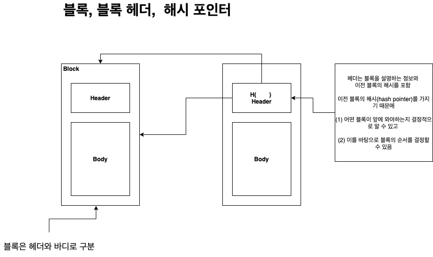


***


</br>
</br>
</br>
</br>


## 블록체인이란? 


정보를 **블록**이라고 하는 단위로 저장하여 저장된 블록들을 체인형태로 묶은 저장기술 


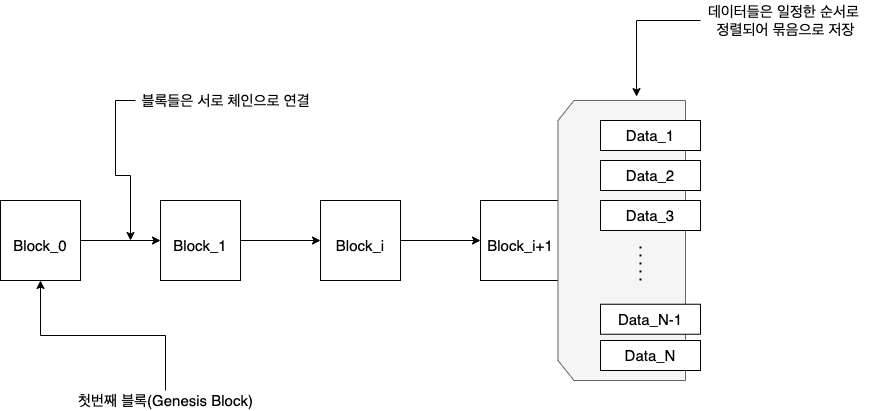


****


</br>
</br>
</br>
</br>


## 블록 높이, 블록생성주기


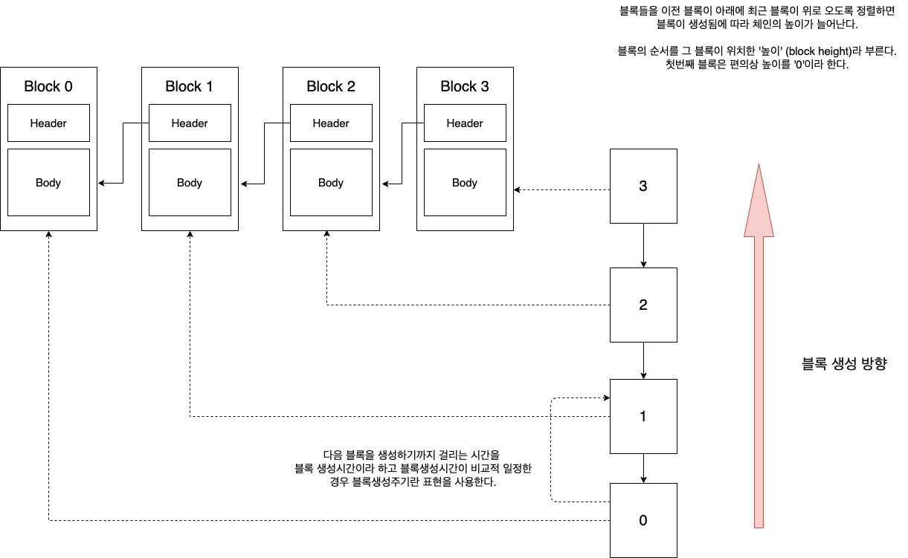


* 비트코인 생성주기 10분

* 이더리움 생성주기 15초

* 클레이튼 생성주기 1초


****


</br>
</br>
</br>
</br>


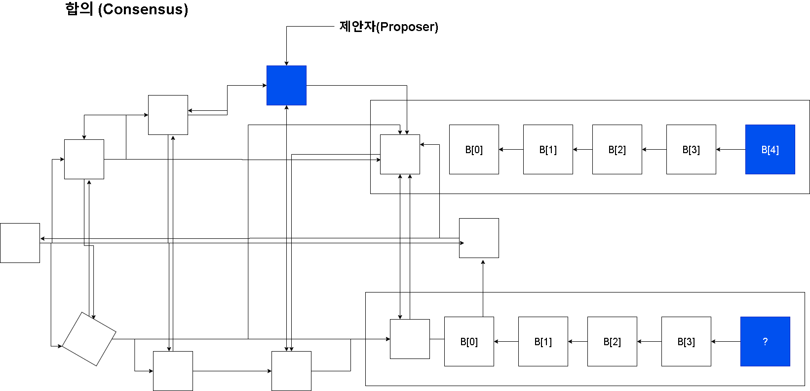


</br>
</br>
</br>
</br>


* 자격이 있는 참여자는 블록을 제안(propose) 할 수 있음
* 블록 제안 자격은 네트워크마다 상이 (e.g. , PoW=Proof of Work 자격증명)
* 노드들은 제안자가 올바른 자격을 취득했는지, 제안된 블록이 올바른지 검증 뒤 블록을 자신의 체인에 추가
* 정족수 또는 정해진 기준을 만족하는 수의 노드가 블록을 자신의 체인에 추가하면 합의가 이뤄졌다고 판단


****


</br>
</br>
</br>
</br>


## 정리 : 블록체인의 성질


* 블록체인은 한명 이상의 참여자가 있는 네트워크에서 관리
* 네트워크 참여자 전원은 모든 블록을 동일한 순서로 저장하여 모두 같은 블록체인을 유지
* 자격이 있는 참여자는 블록을 제안할 수 있음: 블록 제안 자격은 네트워크마다 상이
* 블록이 체인에 추가됨 = 참여자들이 새 블록을 자신의 체인에 추가
* 따라서 새로운 블록이 체인에 추가되려면 네트워크의 합의가 필요: 합의방법은 네트워크마다 상이
  *  어느 한 주체가 단독으로 결정하는 구조가 아닌, 여러 참여자가 합의를 통해 결정하기 때문에 블록체인은 탈중앙화되어 있다고 표현
* 참여자 전원은 이전 블록들을 저장하고 있으므로 새로운 블록의 무결성을 확인가능
* 새롭게 제안되는 블록은 참여자들이 검증 및 합의할 수 있는 형태여야함 (투명성)
* 한번 쓰여진 블록은 이전의 합의를 번복할 수 있지 않는 한 변경될 수 없음 (불변성)


****


</br>
</br>
</br>
</br>


## 합의 알고리즘 비교분석


|                      | PoW (Proof of Work)                                          | PoS (Proof of Stake)                                         | BFT-variants                                                 |
| -------------------- | ------------------------------------------------------------ | ------------------------------------------------------------ | ------------------------------------------------------------ |
| 제안자격 취득 방법   | 계산이 어려운 문제를 풀 것                                   | 플랫폼 토큰을 보유한 양과 기간에 <br />따라 결정적으로 또는 확률적으로 뽑힐 것 | 정해진 순번 또는 정해진 확률에 의해 뽑힐 것                  |
| 네트워크 참여 제한   | 없음                                                         | 없거나 낮음                                                  | 높음                                                         |
| 합의에 필요한 연산량 | 높음                                                         | 낮음                                                         | 낮음                                                         |
| 위협                 | 전체 연산량의 51%를 <br />한 참여자가 <br />소유할 경우 중앙화 됨 | 전체 토큰의 51%를 <br />한 참여자가 소유할 경우 중앙화 됨    | 전체 참여노드의 1/3 이상이 담합할 경우 합의 불가, <br />전체 참여노드의 2/3 이상이 담합할 경우 중앙화 됨 |
| 대표적인 블록체인    | Bitcoin, Litecoin ,Ethereum,Monero,QTUM                      | Ethereum FFG & CFG, EOS(dPoS)                                | Klaytn, Tendermint,Hyperledger Fabric ,Ontology              |


****


</br>
</br>
</br>
</br>


## Public VS Private 


disclaimer : this is a subjective matter


퍼블릭과 프라이빗의 구분은 블록체인에 다음을 수행할 수 있는지 확인하여 결정: 

*  누구든지 기록된 정보(블록)를 자유롭게 읽을 수 있는지?
*  명시적인 등록 또는 자격취득 없이 정보를 블록체인 네트워크에 기록할 수 있는지?


블록체인의 정보가 공개되어 있고 , 네트워크가 정한 기준(e.g., gas fee)에 따라 정보를 기록요청할 수 있다면 그 블록체인은 **퍼블릭/공개형**이라 한다.

이와 반대로 정보가 공개되어 있지 않고 미리 자격을 득한 사용자만이 정보를 기록할 수 있다면 그 블록체인은 **프라이빗/비공개형**이라 한다. 


****


</br>
</br>
</br>
</br>

## Permissionless vs. Permissioned 

disclaimer : this is a subjective matter 

일반적으로 **네트워크의 참여**가 제한된 경우 'permissioned', 그렇지 않은 경우 'permissionless'라 정의

</br>
</br>
</br>
</br>
네트워크의 참여의 정의


* (넓은 의미) 블록체인 P2P 네트워크에 참여
* (좁은 의미) 합의과정의 참여


Public/Private의 개념이 정보의 접근성(Access)와 관련이 있다면 

Permisionless/Permissioned는 정보의 제어(Control),즉 무엇이 블록에 포함되는지를 결정하는 지에 더 밀접한 개념 


****


</br>
</br>
</br>
</br>


## 유형별 블록체인 비교분석


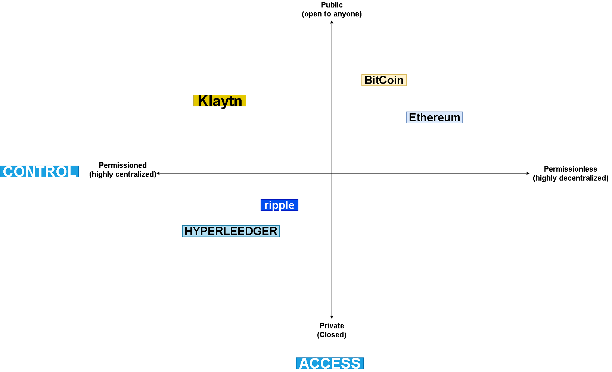


****


</br>
</br>
</br>
</br>


## 암호화


</br>
</br>
</br>
</br>


### 고전적인 암호: 카이사르 암호

암호화하려는 내용을 알파벳별로 일정한 거리(distance, d)만큼 밀어서 다른 알파벳으로 치환하는 기법,

암호를 풀거나 만들 때 알아야하는 정보를 (Key)라고 함. 아래 예제에서 사용된 키는 **d=3**


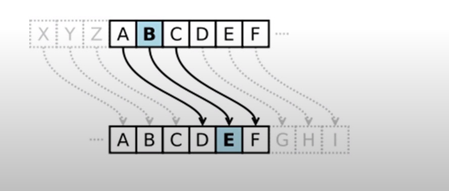


</br>
</br>
</br>
</br>


****


## 대칭키암호 / 비대칭키 암호

평문(Plain Text)이란 암호화 되어 있지 않은 문자열을 의미 


* **암호화**는 평문을 암호로 만드는 것(cipher, encrypt)
* **복호화**는 암호를 평문으로 만드는 것 (dechipher, decrypt)


암호화에 사용한 키와 복호화에 사용한 키가 동일한 경우 **대칭키암호**로 분류

암호화에 사용한 키와 복호화에 사용한 키가 다를 경우 **비대칭키암호**로 분류


****


</br>
</br>
</br>
</br>


## 비대칭키암호 (공개키암호)


두개의 키를 사용하여 암호화와 복호화를 실행


* 암호화에 사용되는 키 = 공개키 (Public Key , PK)
* 복호화에 사용되는 키 = 비밀키 (Private Key/Secret Key, SK)


</br>
</br>
</br>
</br>


비대칭키 암호의 목적:

"누구든지 암호화할 수 있지만 **비밀키를 아는 사람**만 복호화할 수 있어야 한다."


* 공개키와 비밀키는 한쌍으로 묶여있는 아주 큰 숫자들
* 비밀키로부터 공개키를 도출하는 것은 쉬움
* 공개키로부터 비밀키를 찾는 것은 매우 어려움


브루트포스  : 사전 무작위 8대입 공격


****


</br>
</br>
</br>
</br>


## 공개키암호를 사용한 안전한 통신


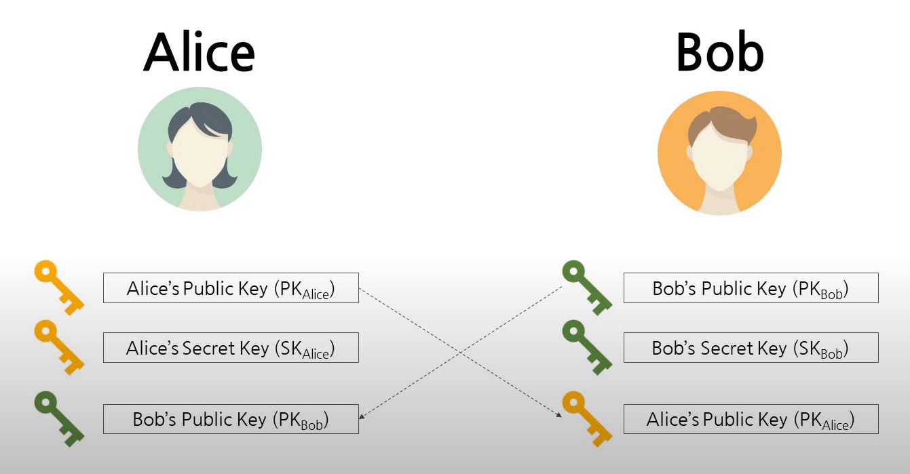


****


## 공개키암호를 사용한 안전한 통신


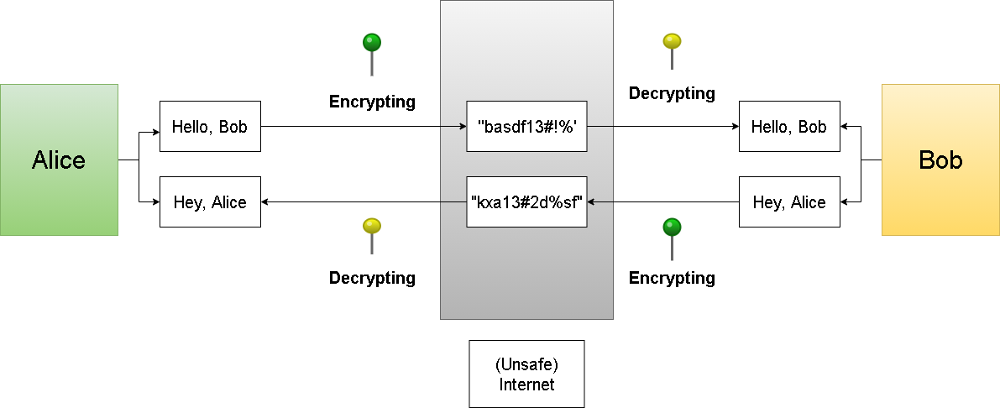


****


## 전자서명


</br>
</br>
</br>
</br>


### 비대칭키암호는 지정된 사람만 정보를 확인할 수 있도록 도움 (privacy)


* Alice가 Bob에게 메시지를 보낼 때 PK(Bob)를 사용


* Bob은 이 메세지가 Alice에게서 온 것인지 어떻게 확인할까?


</br>
</br>
</br>
</br>


### 전자서명은 누가 정보를 보냈는지 알기 위해 사용(non-repudiation)

* 전자서명은 비대칭암호의 응용 프로그램


* 서명은 비밀키로만 생성가능


* 공개키는 서명이 짝을 이루는 비밀키로 생성되었는지를 검증


****


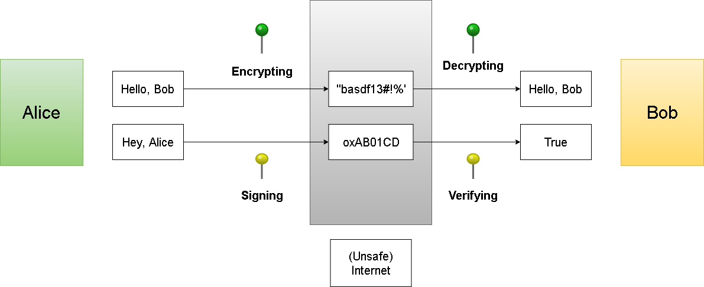


****


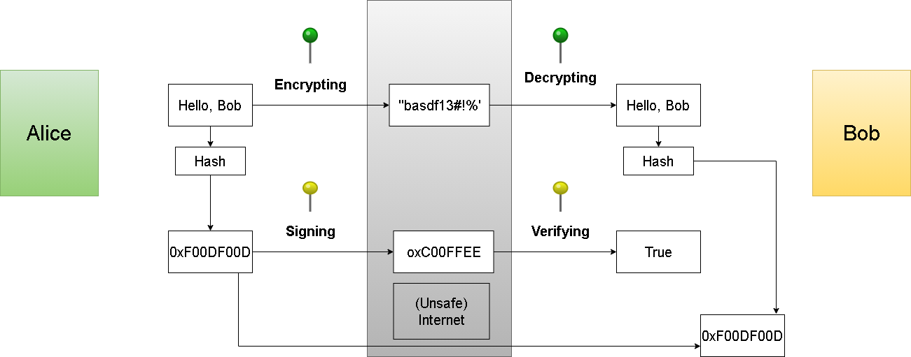


****


</br>
</br>
</br>
</br>


## 블록체인과 공개키 암호


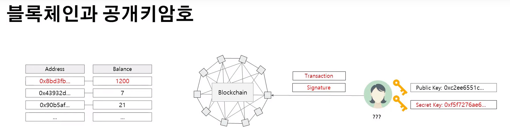


</br>
</br>
</br>
</br>


* 블록체인은 암호학적 기법을 토대로 만들어진 기술


* Bitcoin은 네트워크 참여자 모두가 같은 "**원장**"을  공유함으로써 투명한 거래가 가능


* 원장은 어느주소에 BTC가 있는지 기록하지만 그 주소가  누구에게 속하는지는 기록하지 않음 (anonymity)


* Bitcoin은 공개키암호를 사용하여 **명시적인 비밀교환과정 없이** BTC의 소유권 증명을 실행


****


</br>
</br>
</br>
</br>


## 공개키암호화를 사용한 소유권 증명


* 대부분의 블록체인 주소는 공개키로부터 도출된 값
  *  Bitcoin : Hash 160 of a public key where Hash 160 = RIPEMD160 + SHA256
  *  Ethereum : Rightmost 160 bits of Keccak hash of a public key 


* Bitcoin의 경우
  *  임의의 주소 X에 10 BTC가 있다고 가정할 때 Alice는 X에서 또다른 임의의 주소 Y로 5 BTC를 전송(i.e., transfer 5 BTC from X to Y) 하는 거래를 성사시키기 위해 X로 변환되는 공개키와 짝을 이루는 비밀키로 해당 거래를 서명할 수 있어야 한다.


* Ethereum의 경우

  * 임의의 주소  X에 위치한 어카운트의 잔고에 10 ETH가 있다고 가정할 때 Alice는 X에서 또다른 임의의 주소 Y에 위치한 어카운트로 5 ETH를 전송(i.e., transfer 5 ETH from the account at X to the account at Y) 하는 거래를 성사시키기 위해 X로 변환 되는 공개키와 짝을 이루는 비밀키로 해당 거래를 서명할 수 있어야 한다. 

  


****


</br>
</br>
</br>
</br>


## 구현 방법으로 나눠본 블록체인


### UXTO (Unspent Transaction Output) 기반 블록체인


* 블록체인에 사용 가능한 토큰 (e.g., Bitcoin) - UXTO들과 사용 자격검증방법을 기록


* 일반적인 자격검증방법은 UTXO의 정보와 일치하는 공개키로 검증 가능한 전자서명을 제출하는 것 

  

* Bitcoin이 대표적인 UTXO 기반 블록체인


### 어카운트 기반 블록체인 (Account-based Blockchain)


* 어카운트는 블록체인을 구성하는 주체(entity)를 표현하며 상태를 기록


* 사용자는 어카운트를 사용할 때마다 어카운트 공개키로 검증가능한 전자서명을 생성


* 상태를 기록할 수 있기 때문에 스마트 컨트랙트를 구현하기에 용이


*  Ethereum, Klaytn이 대표적인 어카운트 기반 블록체인


****


</br>
</br>
</br>
</br>


## Ethereum 어카운트, 주소, 상태


* Ethereum의 어카운트는 Ethereum의 주체(entity)를 표현하고 그 상태를 기록하는데 사용


* 어카운트는  **EOA(Externally Owned Account)**와 **스마트 컨트랙트**로 구분


* Ethereum 사용자는 EOA를 사용

* 사용자는 임의의 공개키와 비밀키 쌍(Key Pair)을 생성한 뒤 공개키를 어카운트 주소로 변환하여 EOA를 생성

  * 별도의 승인과정이 필요없으며 Ethereum 네트워크와 통신도 필요없음
  * 위 과정으로 인해 어카운트는 특정 키페어에 종속

  

* 사용자의 상태 (state)는 어카운트 주소로 찾을 수 있는 블록체인 저장공간에 기록


</br>
</br>
</br>
</br>

(예시 )

| 비밀키                           | 공개키                                                       | 주소                   |
| -------------------------------- | ------------------------------------------------------------ | ---------------------- |
| 0x5dasdf1sdafasdfasdfasdfasdfc39 | 0x129fmdsaiofm23msdlfmasldkfmsadf<br />mlxckzmvsaodfasjfmsakdlfsa dklfmsaio<br />samfsakldfm19041j0924t odsf09asn134<br />ndsfasdf0314n | 0x304ek3489sdmf92340df |


</br>
</br>
</br>
</br>


****


## 트랜잭션(Transaction, TX)


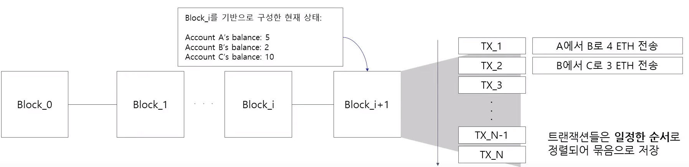


</br>
</br>
</br>
</br>


* 블록은 트랜잭션들을 일정한 순서로 정렬하여 저장하는 컨테이너


* 트랜잭션은 어카운트의 행동


* 트랜잭션의 순서는 중요: TX_1 > TX_2와 TX_2 > T_X1은 다름 (왜냐하면, 위 그림과 같이 balance가 5인데 10을 보낼수 없듯이 트랜잭션의 순서는 가용가능한 만큼 순서대로 동작해야됨)


* 블록체인 참여자들은 블록을 검증할 때 트랜잭션들이 올바른 순서대로 정렬되었는지를 확인 후 합의


* 각각의 트랜잭션들은 어카운트에 연결된 공개키로 검증가능한 서명을 포함


</br>
</br>
</br>
</br>


****


## Transaction Journey


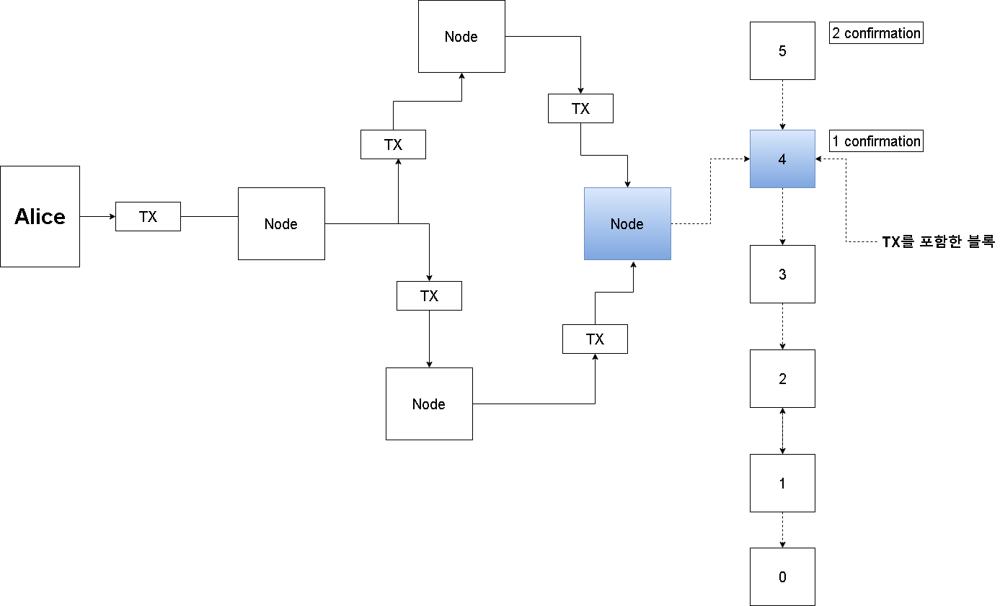


****

</br>
</br>
</br>
</br>


## Confirmation VS. Finality


* Confirmation 숫자는  트랜잭션이 블록에 포함된 이후 생성된 블록의 숫자
  * 임의의 트랜잭션 T가 포함된 블록의 높이가 100, 현재 블록높이가 105라면 T의 confirmation 숫자는 6 


* PoW를 사용하는 블록체인들은 finality가 없기 때문에 confirmation 숫자가 중요


* Finality란 블록의 완결성을 의미

  * 합의를 통해 생성된 블록이 번복되지 않을 경우 완결성이 존재

  

* PoW 기반 합의는 확률에 기반하기 때문에 경우에 따라 블록이 사라질 수 있으므로 완결성이 부재함

  * PoW 블록체인은 수학적으로 복잡한 퍼즐을 풀어 블록을 제안할 자격을 얻는 구조
  * 만약 두명의 서로 다른 참여자가 동시에 퍼즐을 풀어 두개의 올바른 블록을 생성한다면 두 블록 중 하나는 (Eventually) 사라지게 됨
  * 이 때문에 블록이 확률적 완결성을 갖기까지 일정 갯수 이상의 블록이 생성되기를 기다려야 함


Confirmation 숫자가 왜 중요하나? 약간의 딜레이로 블록체인에서 노드가 새로 생성될 때 1-2개의 노드는 번복되는 것이 차이가 날 수 있다. 그러나

몇개이상은 차이나기 어렵다. 비트코인은 6개정도 제한, 이더리움은 7개 정도 제한


****


</br>
</br>
</br>
</br>


## 

## Understanding Bitcoin's 6 Confirmations Rule


* 네트워크 시차로 인해 생성된 우연한 복수의 블록들 가운데 선택되는데 필요한 블록은 두어개 정도 >> 2~3 confirmations 


* 퍼즐을 빠르게 풀 수 있는 악의적인 참여자(공격자)가 있을 경우 그 참여자의 해시능력(hash power)에 따라 필요한 confirmation 숫자가 달라짐

  

  * 해시능력이 높을 수록 퍼즐을 푸는 속도도 빠르기 때문에 주어진 문제를 먼저 풀 확률이 높아짐
  * 해시능력이 높은 참여자는 longest chain을 임의로 선택 또는 생성할 수 있음
  * 따라서 해시능력을 감안하더라도 임의로 블록체인을 변경하지 못할 정도로 충분히 많은 블록이 생성되기를 기다려아할 필요가 생김
  * Bitcoin의 6 confirmation 법칙은 공격자가 전체 해시능력의 약 25%를 가질 때를 가정한 숫자


</br>
</br>
</br>
</br>

****


</br>
</br>
</br>
</br>
 

## #Confirmations to wait if...


PoW 블록체인이 공격자가 전체 해시능력의 x%를 가질 때 99.9% 완결성을 확보하려면 다음과 같은 confirmation 숫자가 필요


(예시: BitCoin 기준)

| x    | # confirmations | 기다려야 하는 시간 |
| ---- | --------------- | ------------------ |
| 10   | 4               | 40분               |
| 25   | 7               | 1시간 10분         |
| 33   | 10              | 1시간 40분         |
| 49   | 170             | 2시간 50분         |


****
</br>
</br>
</br>
</br>

## BFT 기반 블록체인


* BFT 기반 블록체인은 블록의 완결성이 보장됨

  * 네트워크가 동기화되어 있기 때문
  * 블록 생성이 PoW에 비해 빠르고 경제적

  

* 하지만 네트워크 동기화의 필요로 인해 참여자의 숫자가 제한됨

  * 네트워크 참여자 구성이 고정되어 있어야 합의가 가능
  * 구성이 변경될 경우 모든 네트워크 참여자가 새로운 구성을 인지하기까지 합의 불가능
  * 합의 알고리즘이 네트워크 동기화를 가정하고 짜여졌기 때문에 네트워크 사용량이 높음
  * 참여자가 많아질 경우 네트워크 오버헤드로 인해 합의가 느림


****

</br>
</br>
</br>
</br>

## Klaytn BFT


* Klaytn은 확장가능한 BFT를 사용
  * N개의 노드 가운데, S개의 부분노드 집합을 확률적으로 선택(where N is large , and S is sufficiently small)
  * 전체집합을 거버넌스 카운실(Governance Council),
  * 부분집합을 커미티(Committee)로 정의
  * 커미티 선택은 VRF*(랜덤으로 뽑는 방식)로 구해진 무작위 값에 기반
* 매 블록마다 새 커미티를 뽑아  BFT를 실행
* 기존의 BFT에 비해 확장성을 크게 개선


</br>
</br>
</br>
</br>


****

</br>
</br>
</br>
</br>


- 메모
클레이튼이  BFT를 쓰는 이유는 PoW가 너무 느리기 때문에 그렇다.
PoW는 성능이 너무 느리다.
PoS, 지분증명방식에서 자본이 많으면 그 네트워크의 권한을 가질 수 있다.
클레이튼은 거대한 전체집합에서 특수한 ,무작위 방법으로 부분집합을 뽑는다. 그리고 
부분집합에서 BFT를 실행해서 블록을 생성하고, 합의된 네트워크를 다른 블록으로 전달한다.


</br>
</br>
</br>
</br>

****


## Blockchain State 


## (어카운트 기반 ) 블록체인의 상태 
### 블록체인은  트랜잭션으로 변화하는 상태 기계 (State Machine)
</br>
</br>
</br>
</br>
block_0 {
  [state 1]
  i: none
  Changes:
  [0] : Genesis -->
  Alice / 100

  f : ['Alice' : 100]
}

</br>
</br>
</br>
</br>
block_1 {
  i: ['Alice' : 100]

  Changes:
  [0] : Coinbase --> 
  Alice / 100 
  [1] : Alice --> Bob / 30 

  f:['Alice': 170, 'Bob':30]
}


</br>
</br>
</br>
</br>


block_2 {
  i:['Alice':170, 'Bob':30]

  Changes:
  [0] Coinbase -->
  Bob / 100
  [1] Bob --> Alice / 30
  [2] Bob --> Charlie / 20

  f: ['Alice':200, 'Bob':80,
  'Charlie':20]

}

- 메모
- 앞의 블록의 최종값이 다음 블록의 초기값이 된다. 초기값들의 변경들을 더해 최종값을 구한다.
- 초기블록에서는 none으로 시작해서 
- 트랜잭션은 항상 from에서 to가 있다.  >> 어디에서 어디로 간다.
- source가 coinbase라는 것은 이것이 마이닝을 했구나 라는 뜻
- State1에서는 Alice가 토큰 100개를 받음
- State2에서는 Alice가 토근 30개를 Bob에게 줬고, 앞의 블록 100개에서 남은 70개를 더해서 170개가 됐음
- 위에 설명에는 수수료는 빠져있는 것이다.
- 블록체인은 위와 같은 구조에서 반복되서 계속해서 블록이 생성되는 것이다.


</br>
</br>
</br>
</br>


***


</br>


## 상태기계


</br>


* ### 블록체인은 **초기 상태**에서 **변경사항**을 적용하여 **최종상태**로 변화하는 상태 기계

  *  이전 블록의 최종 상태(final state)는 현재 블록의 초기 상태(initial state)
  *  Gen block의 경우 임의의 초기값들이 설정되는데 이것이 gen block의 초기상태이자 최종상태

</br>


* ### (어카운트 기반) 블록체인의 상태
  *  TX는 어카운트를 생성하거나 변경
     *  e.g., Alice가 기존에 존재하지 않던 주소 X에 1 ETH를 전송하면 새로운 EOA가 생성 
     *  e.g., Alice가 새로운 스마트 컨트랙트를 배포 (컨트랙트도 어카운트)
     *  e.g., Alice가 Bob에게 5 ETH를 전송하는 TX가 체결되면 Alice의 Bob의 잔고가 변경 

   * 항상 같은 결과를 보장하기 위해 하나의 TX가 반영되는 과정에서 다른 TX의 개입은 제한됨


</br>


- 메모
- 비트코인이 나오게 된 아이디어는 은행이 원장을 가지고 있는데, 은행을 믿고 원장을 맡기지 말고, 우리 모두가 원장을 가지고 있으면 은행이 꼭 필요하겠어? 라는 아이디어였다. 


</br>
*** 


## (Recall) Ethereum 어카운트의 종류

### 1. External Account : 사용자(end user)가 사용하는 어카운트(a.k.a EOA)

  ### 2. Contract Account : 스마트 컨트랙트를 표현하는 어카운트
</br>

  * Ethereum은 EOA와 스마트 컨트랙트의 상태를 기록 및 유지
  
    * 스마트 컨트랙트는 특정주소에 존재하는 **실행 가능한 프로그램**
    * 프로그램은 상태를 가지기 떄문에 Ethereum/Klaytn은 스마트 컨트랙트를 어카운트로 표현

</br>

* EOA는 블록에 기록되는 TX를 생성
  * 블록에 기록되는 TX들은 명시적인 변경을 일으킴 
     </br>
     (e.g., 토큰 전송, 스마트 컨트랙트 배포/실행)


</br>  

***

</br>


## 트랜잭션(TX)과 가스(Gas)

</br>


* TX의 목적은 블록체인의 상태를 변경하는 것 
  * TX는 보내는 사람(sender, from)과 받는 사람(recipient,to)이 지정되어 있으며
  * to가 누구냐에 따라 TX의 목적이 세분화 


</br>

* Gas: TX를 처리하는데 발생하는 비용
  *  TX를 처리하는데 필요한 자원(computing power, storage)을 비용으로 전환한 것이 가스(gas)
  *  Sender는 TX의 처리를 위해 필요한 가스의 총량과 같은 가치의 **플랫폼 토큰**을 제공해야함
  *  이때 지출되는 플랫폼 토큰을 가스비(Gas Fee)라 정의
  *  가스비는 블록을 생성한 노드가 수집


</br>
</br>


***

</br>
</br>


## 트랜잭션과 서명

* ### 플랫폼은 sender가 TX가 처리되는데 필요한 가스비를 가지고 있는지 확인
  * 가스비 확인은 구현에 따라 상이
  * Ethereum/Klaytn은 노드가 TX를 수신함과 동시에 가스비 이상의 balance가 있는지 확인
  * TX의 체결과 동시에 sender의 balance에서 가스비를 차감

</br>

* ### TX는 sender의 서명 (v,r,s)이 필요
  * 어카운트의 balance를 사용하기 때문
  * 서명의 증명은 구현마다 상이
    * Ethereum: 서명 > 공개키 도출 > 어카운트 주소 도출 > 어카운트 존재유무 확인
    * Klaytn : from 주소 확인 > 저장된 공개키 불러오기 > 서명 직접 검증

</br>


***


<br>


</br>


****

</br>


## 트랜잭션 예시

```

{
  nonce : 1 ,  #어카운트가 몇번째 트랜잭션을 보내는것인지 말해주는 것  </br>
  from : '0xd0ea3e0eabaea095ea3ba231c0431sdafda', #sender의 주소 </br>
  to : '0x5e47b19asdfasdfasfasdfasdfasd0fsadfm9', #recipient의 주소</br>
  value : 10,  </br> 
  // omitted other fields for brevity
  // platform specific fields are required 

} 

```


</br>

***

</br>

## Ethereum 트랜잭션 예시

```
{

  nonce: '0x01',
  gasPrice : '0x4a817c800',    //20,000,000,000
  gas : '0x5208',              //21,000 , 내가 몇개까지 gas를 쓰겠다. 
  value : '0xde0b6b3a7640000', //1,000,000,000,000,000,000 = 1ETH

  to : '0x35353535353535353535353535353535353535',
  v  : '0x25',
  r  : '0x4f4c17305743700648bc4f6cd3...757234d9jfa9s',
  s  : '0xasdfaser23df82n398dfmsd0fs...asdf9n320ds3a'
  // some fields are omitted for brevity
  // from은 없음, 그렇게 해서 160비트를 아끼려고 함
  // v,r,s는  v는 식별자고 ,서명은 r과 s다. 
}

```


</br>

***

</br>


## Klaytn 트랜잭션 예시

```

{

  type: 'VALUE_TRANSFER', #Ethereum과 차이점
  nonce : '0x01',
  gasPrice: '0x05d21dba00', #사용자가 바꿀수 없음, 고정값 
  gas : '0x0493e0',
  value : '0x01',

  to: '0xef5cd88asdf8m0sa9dmf9a0sdfmas0df',
  from: '0xd01b138d49fb2w324m9eamf09asdsd', #Ethereum과 차이점

  v : '0x07f6',
  r : '90sadmfas9d0fmsa09..0as9dfnm0sa9dfm90sa',
  s : '0asdmf9sadmf90saff..90smdf09asdfm9dsfm9'

}

```

</br>

***

</br>


## Alice와 Node 사이 통신


### Alice >> Node 

* Alice는 TX를 생성, 서명하여 Node에게 전달
* 이떄 데이터 구조를 온전하게 전달하고자 RLP 알고리즘으로 TX를 직렬화
* Alice와 Node가 같은 프로토콜로 통신하는 것이 중요


</br>
</br>

###  Node >> Alice
* 올바른 TX 수신시 TX 해시를 반환
* TX 체결 시  Receipt를 반환; 소요된 Gas, TX 해시, input 등이 기록


</br>
</br>


***


</br>
</br>


## Smart Contracts 

</br>

* 특정 주소에 배포되어 있는 TX로 실행 가능한 코드
  *  스마트 컨트랙트 소스코드는 **함수**와 **상태**를 표현; 컨트랙트 소스코드는 블록체인에 저장
  *  함수는 상태를 변경하는 함수, 상태를 변경하지 않는 함수로 분류
  *  사용자(end user, EOA owner)가 스마트 컨트랙트 함수를 실행하거나 상태를 읽을 때 주소가 필요

</br>

* 스마트 컨트랙트는 사용자가 실행 
  *  상태를 변경하는 함수를 실행하려면 그에 맞는 TX를 생성하여 블록에 추가 </br>
     (TX 체결 = 함수의 실행)
  *  상태를 변경하지 않는 함수, 상태를 읽는 행위는 TX가 필요 없음 </br>
     (노드에서 실행)


</br>

***

</br>


## Solidity 

</br>

* Ethereum/Klaytn에서 지원하는 스마트 컨트랙트 언어 
* Klaytn은 Solidity 버전 0.4.24 , 0.5.6을 지원
* 일반적인 프로그래밍 언어와 그 문법과 사용이 유사하나 몇가지 제약이 존재
  * e.g., 포인터의 개념이 없기 때문에 recursive type의 선언이 불가능

</br>
</br>


***

</br>


## Contract = Code + Data 

</br>

* Solidity 컨트랙트는 코드(함수)와 데이터(상태)로 구성
* Solidity 함수는 코드 안에 변수로 선언된 상태를 변경하거나 불러옴
* 아래 예시에서 set, get은 함수, storedData는 상태


</br>

```
contract SimpleStorage {


  uint storedData;

  function set(uint x ) public {
    storedData = x; 
  }

  function get() public view returns (uint) {
    return storedData;
  }


}

```


</br>

***

</br>


## Solidity 예제 - Coin 컨트랙트

// Solidity로 간단한 포인트 시스템을 구현
// [Coin 컨트랙트]
// 컨트랙트 생성자가 관리하는 포인트 시스템 컨트랙트로 포인트 시스템 고유의
// 주소공간(address space)을 가지며 각 주소의 포인트 잔고를 기록한다.
// 컨트랙트 생성자는 사용자 주소(e.g., 0xALICE)에 포인트를 부여할 수 있고
// 사용자는 다른 사용자에게 포인트를 전송할 수 있다.(e.g., 0xALICE >> 0xBoB, 10 Coins)

```
contract Coin {

//omitted for brevity

}
```


</br>

***


</br>


## Solidity 예제 - 상태 (State Variables)

</br>

```
// "pragma solidity" 키워드는 Solidity 버전을 지정
pragma solidity ^0.5.6;

// "contract X {...}"는  X라는 컨트랙트를 정의
contract Coin {

  // "minter"는 address 타입으로 선언된 상태;  address 타입은 Ethereum에서 사용하는 160비트 주소

  address public minter; 

  // "balances"는 mapping 타입으로 address 타입 데이터를 key로 uint 타입 데이터를 value로 가지는 key-value mapping 
  // mapping은 타 프로그래밍 언어에서 사용하는 해시테이블 자료구조와 유사 
  // (uninitialized 값들은 모두 0으로 초기화 되어있는 상태)
  mapping (address => uint ) public balances; 

  // omitted for brevity
  // 간결함을 위해 생략 
}

```

</br>


***

</br>


## Solidity 예제 - 이벤트(Events)

</br>

```

contract Coin {


// [omitted state variables for brevity ]
// 간결함을 위해 생략된 상태 변수


// event로 정의된 타입은 클라이언트(e.g., application using a platform-specific SDK/Library)가 

// Listening 할 수 있는 데이터로 emit 키워드로 해당 타입의 객체를 생성하여 클라이언트에게 정보를 전달

// usage:
// /* in Solidity */
// emit Sent(an_address, another_address, 10);
// /* in web3.js */
// Coin.Sent().watch({}, '', function(err, result) {...}; )
event Sent(address from , address to, uint amount);

// [omitted for brevity]
// omitted : 생략
// brevity : 간결,짧음
}


```

</br>


</br>


***


</br>

## Solidity 예제 - 생성자함수 (Constructor)

</br>

// N.B. 컨트랙트 함수는 함수를 실행한 TX의 정보를 받을 수 있는데 해당 정보를 msg 변수로 접근

// 자세한 정보는 https://docs.soliditylang.org/en/v0.4.24/units-and-global-variables.html#block-and-transaction-properties 참조 

```

contract Coin {


// [omitted state variables and event definitions for brevity]

// 생성자 함수는 컨트랙트가 생성될 때 한번 실행!!


// 아래 함수는 minter 상태변수에 msg.sender 값을 대입 (함수를 실행한 사람의 주소)
constructor () public {
  minter = msg.sender;
}

// [omitted for brevity]


}


```


</br>


***


</br>


## Klaytn SDK (Software Developement Kit)

* Klaytn은 BApp 개발을 위해 필요한 SDK를 제공
* caver-js는 Node.js로 Klaytn BApp을 만들때 필요한 라이브러리를 제공
* 다음 온라인 문서에서 사용방법을 확인 : https://docs.klaytn.com/dapp/sdk/caver-js


</br>


***


## 개발환경 셋팅

</br>

### Node.js 설치 
* https://nodejs.org에서 10.16.3 LTS 설치 (installer/pkg 실행)
  

### 개발 디렉토리 생성 및 Caver-js 설치

* 성공적으로 Node.js를 설치한 뒤 원하는 위치에 개발 디렉토리를 생성
  *  mkdir Count && cd Count 


* 디렉토리 생성 후 npm으로 Node.js 프로젝트를 초기화, caver-js를 설치 
  * npm init
  * npm install caver-js 


</br>

***
</br>


## Baobab 테스트 넷에 연결
const Caver = require('caver-js');
const caver = new Caver('https://api.baobab.klaytn.net:8651/');


</br>


</br>

***
</br>


## klay.getBlockNumber()

</br>

```
const Caver = require('caver-js');
const caver = new Caver('https://api.baobab.klaytn.net:8651/');

// getBlockNumber() returns a Promise object returning Number 

caver.klay.getBlockNumber(function(err, blockNumber){
  console.log(blockNumber);
});

//alternatively
caver.klay.getBlockNumber().then(console.log);
```


</br>

***


## klay.accounts.wallet 


</br>

```

const account = caver.klay.accounts.create(); 
//key pair 생성해줌 , 비밀키,공개키

// in-memory wallet , 어카운트를 담고있는 wallet 지정

const wallet = caver.klay.accounts.wallet;

wallet.add(account);

console.log(wallet.length); // wallet에 저장된 어카운트 갯수를 리턴 
console.log(wallet[account.address]); //해당 주소를 가지는 어카운트를 불러옴; 없을 경우 undefined 
console.log(wallet[0]); // 저장된 첫번째 어카운트를 불러옴; 없을 경우 undefined 


```

</br>


***


## 토큰전송 TX 생성 & 서명 

</br>

```

wallet.clear(); wallet.create(2); // in-memory wallet 초기화 & 어카운트 2개 생성

const tx = {

  type : "VALUE_TRANSFER", from: wallet[0].address, to: wallet[1].address, 
  // type, sender, recipient 
  value : caver.utils.toPeb('1','KLAY'),
  // 1 KLAY 전송 
  gas : 300000
  // TX가 사용할 수 있는 가스총량
};

// 첫번째 어카운트의 비밀키로 서명

caver.klay.accounts.signTransaction(tx,wallet[0].privateKey).then(console.log);


```

</br>


*** 


</br>


## 서명된 TX 전송

</br>


```


const tx = { ... };

(async () => {


  const signedTransaction = await caver.klay.accounts.signTransaction(tx, sender.privateKey)

  await caver.klay.sendSignedTransaction(signedTransaction.rawTransaction) 

  .on('transactionHash', function(txhash) { console.log('hash first', txhash); }) // .on은 이벤트 리스닝한다는 것임 , transactionHash면 이 이벤트를 실행한다

  .on('receipt', function(receipt) { console.log('receipt later', receipt); })
  // .on은 이벤트 리스닝한다는 것임 , receipt면 이 이벤트를 실행한다

  .on('error', function(err) { console.error('something went wrong'); }); 


})();

```


</br>

***


</br>

## 토큰전송TX + sendTransaction 

```

const tx = {... };


caver.klay.sendTransaction(tx) // 서명 + 전송
  .on('transactionHash', function(txhash){
    console.log('hash first', txhash);
  })

  .on('error', function(err){
    console.log('something went wrong');
  })

  .on('receipt', function(receipt){
    console.log('receipt later', receipt);
  });


```


***

</br>


## 스마트 컨트랙트 배포


</br>


```

// 앞서 예제에서 본  SimpleStorage 컨트랙트의 ABI와 Bytecode를 사용

const abi = [ ... ];

const contract = new caver.klay.Contract(abi);

contract.deploy({ data : '6039024-250..0234' })

  .send({from: wallet[1].address,
         gas: 3000000,
         value : 0})
  
  .on('receipt', function(receipt){
    //컨트랙트 주소가 receipt에 포함
    console.log('contract deployed at' ,receipt.contractAddress);
  })


```

*** 


</br>


## 스마트 컨트랙트 함수 실행 (mutation, 변화)


</br>


```

const contract = new caver.klay.Contract(abi, '0x20sdfm293f0fma0dfad0sf');

contract.methods.set(100) // SimpleStorage의 set 함수를 실행; 상태를 바꾸는 함수이기 때문에 TX로 실행

.send ({
  from : wallet[1].address,
  gas : 3000000
})

.on('error', function (hash) { ... })

.on('transactionHash', function (hash) { ... })

.on('receipt', function (receipt) { ... })

```


</br>


****


## 스마트 컨트랙트 함수 실행 (constant, 상태를 바꾸지 않고 읽어옴)


```

const contract = new caver.klay.Contract(abi, '0x20sdfm293f0fma0dfad0sf');

// call 함수는 상태를 바꾸는 함수가 아니기 때문에 노드에서 바로 실행 

contract.methods.get().call(null, function (err, result){

  if (err == null){
    console.log(result);
  }
  else{
    console.error(err);
  }
});


```


